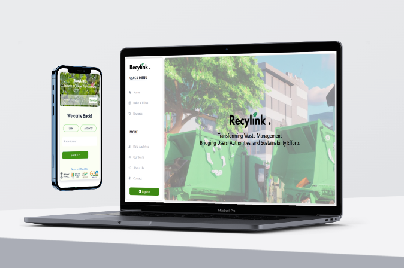

# **
Welcome to Recylink!
**

Recylink is a user-centric digital platform focusing on waste management in India. It enables seamless reporting and resolution of waste-related issues by connecting users with local authorities. A deep learning model categorizes waste for efficient collection and transport. The website offers multilingual support and includes a rewards system where users earn points for reporting litter, redeemable for coupons and gift cards.

 
 

    

## 📱Navigating Recyclink

- [Technologies used](#technologies_used)
- [Features](#features)
- [Profile](#profile)
  - [User](#user)
  - [Authority](#authority)
- [Rewards](#rewards)
- [Creators](#creators)

## 🏗️Technologies Used

## 🎯Features

 - User-Centric Interface: Foster community engagement by empowering users to report grievances, facilitating optimal waste collection solutions suggested by the 
platform, enhancing collaboration with local authorities.

 - Smart Waste Categorization: Improve waste management efficiency through deep learning, sorting waste into bio-degradable, non-biodegradable, and recyclable categories, streamlining transport to designated treatment facilities.

 - Multilingual Accessibility: Enhance inclusivity in India by providing a user-friendly website with seamless multilingual support, accommodating diverse linguistic preferences for widespread participation.

 - Rewarding Sustainability: Encourage eco-friendly behavior with the RecyRewards system, where users earn points for reporting litter, promoting a sustainable ecosystem through redeemable incentives like coupons, gift cards, and custom rewards.

## 📄Profile

### 🙋User
 - **Seamless Submission**: Easily submit detailed waste complaints, including images, on Recylink's user-friendly platform.

 - **Efficient Tracking**: Track complaint progress and resolution updates through Recylink's ticketing system.

 - **Verification of Cleanup**: Verify cleanup with provided proof for transparency in waste management.

 - **Robust Rewards System**: Earn points for reporting litter on Recylink, redeemable for coupons, gift cards, and customized rewards.

 - **Community Engagement**: Foster community responsibility and participation in sustainable waste management practices through Recylink's integrated approach.

### 🧑‍💼Authority

 - **Dashboard Review**: Recylink authorities assess tickets, prioritizing based on waste classification and reported garbage types.

 - **Priority-Based Assessment**: Thorough evaluation considers assigned priority and specific waste types for a comprehensive understanding of concerns.

 - **Task Assignment Efficiency**: Efficient assignment of cleanup tasks with established deadlines streamlines and prioritizes waste resolution efforts.

 - **Transparent Documentation**: Upload relevant details and documentation for transparency, providing users with comprehensive information on waste management resolutions.

## 🎁Rewards

 - **Incentivized Reporting**: Recylink motivates users to report waste actively through a robust rewards system.

 - **Earn-and-Redeem System**: Users accumulate points for reporting litter, which can be redeemed for coupons, gift cards, and customized rewards.

 - **Diverse Redemption Choices**: The rewards program offers a range of options, allowing users to choose incentives that suit their preferences.

 - **Community Engagement Boost**: This approach not only encourages reporting but also nurtures community engagement, fostering responsibility in sustainable waste   
   management practices.
